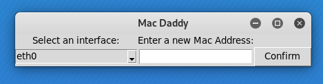

# Mac_Daddy
Mac Daddy is a program designed to allow the user to change the Mac Address temporarily. The GUI makes the program very intuitive and easy to use! The program pulls a list of network interfaces from the computer that the use can select from, and allows them to enter a new Mac Address! The program checks to ensure the Mac Address is a valid Mac Address and will inform the user if something goes wrong! Designed for Linux systems only.

